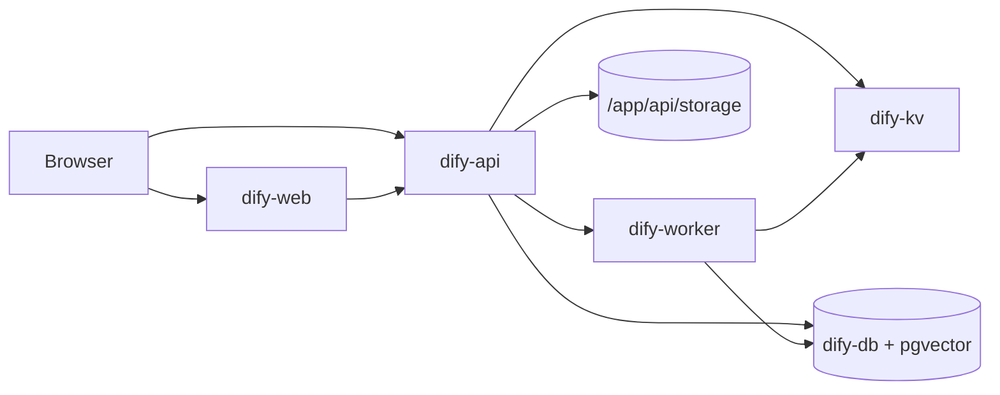

<div align="center">

# Dify on Render

Deploy **Dify**, the open-source LLM app platform, on Render with official `langgenius` Docker images, pgvector Postgres, and Key Value for Celery.

<p>
  <a href="https://render.com/deploy-template/api/github/start?template_repo=dify-render-template">
    
  </a>
</p>

<p>
  <a href="https://render.com">
    
  </a>
  <a href="https://github.com/langgenius/dify">
    
  </a>
  <a href="https://hub.docker.com/u/langgenius">
    
  </a>
  <a href="https://docs.dify.ai">
    
  </a>
</p>

</div>


## What This Template Shows

This repo packages Dify's official Docker images as a one-click Render Blueprint. No monorepo build on Render.

| Piece | Role |
| --- | --- |
| **[Dify](https://github.com/langgenius/dify)** | LLM app platform: studios, agents, knowledge, workflows |
| **[langgenius/dify-api](https://hub.docker.com/r/langgenius/dify-api)** | API + Celery worker image |
| **[langgenius/dify-web](https://hub.docker.com/r/langgenius/dify-web)** | Next.js console |
| **[Render Web Services](https://render.com/docs/web-services)** | `dify-api` (Standard) + `dify-web` (Starter) |
| **[Render Background Worker](https://render.com/docs/background-workers)** | `dify-worker` (Standard) |
| **[Render Key Value](https://render.com/docs/key-value)** | Celery broker + cache |
| **[Render Postgres](https://render.com/docs/postgresql)** | App DB + pgvector |
| **[Render Disk](https://render.com/docs/disks)** | API local storage at `/app/api/storage` |

## Architecture



### How It Works

1. Click **Deploy to Render**. Render forks this template and applies [`render.yaml`](./render.yaml).
2. Render pulls pinned `langgenius/dify-api:1.14.2` and `langgenius/dify-web:1.14.2`.
3. First API deploy enables the Postgres `vector` extension, runs migrations, and mounts a 10 GB disk.
4. Open the **`dify-web`** URL to create the admin account and configure model providers in the UI.
5. Background jobs (indexing, workflows) run on `dify-worker` via Key Value / Celery.

| Resource | Type | Plan | Notes |
| --- | --- | --- | --- |
| `dify-api` | Web (`runtime: image`) | **standard** | Health `/health`; 10 GB disk; `vector` extension hook |
| `dify-worker` | Worker (`runtime: image`) | **standard** | Same API image, `MODE=worker` |
| `dify-web` | Web (`runtime: image`) | **starter** | Console UI |
| `dify-kv` | Key Value | **starter** | Broker + cache; private |
| `dify-db` | Postgres 16 | **basic-256mb** | Private; pgvector |

Default region: **oregon**. Keep every resource in the same region. Previews are off. **Standard is the floor for `dify-api` / `dify-worker`**: Starter often OOMs and shows "No open ports detected."

## Quick Start

### Prerequisites

- A [Render account](https://dashboard.render.com/register?utm_source=github&utm_medium=referral&utm_campaign=ojus_demos&utm_content=readme_link)
- LLM provider keys configured in the Dify UI after first login (not required at Apply)

### Deploy

1. Click **Deploy to Render** above and fork into your GitHub account.
2. On Apply, confirm all five resources (api, worker, web, kv, db).
3. Wait until services are **Live** (~8–15 minutes; first image pulls can take longer).
4. Open the **`dify-web`** URL and complete admin setup.
5. Add model providers in Settings, then create an app or knowledge base.

API health:

```bash
curl -sS https://<your-dify-api>.onrender.com/health
```

## Features

| Feature | Description |
| --- | --- |
| **Official images** | Pinned `langgenius/dify-api` + `dify-web` tags |
| **One-click Blueprint** | Web + worker + KV + Postgres via `projects` / `environments` |
| **pgvector** | Extension created on first API deploy |
| **Persistent uploads** | 10 GB disk on `dify-api` |
| **Generated secret** | `SECRET_KEY` created on first deploy |
| **Private data plane** | Postgres + Key Value `ipAllowList: []` |

## Configuration

| Variable | Source | Description |
| --- | --- | --- |
| `SECRET_KEY` | Auto-generated | App secret on `dify-api`; worker inherits it |
| `MODE` | Wired | `api` on API, `worker` on worker |
| `DEPLOY_ENV` | Wired | `PRODUCTION` |
| `MIGRATION_ENABLED` / `LOG_LEVEL` | Wired | API migrate + log level |
| `CONSOLE_API_URL` / `SERVICE_API_URL` / `FILES_URL` / `INTERNAL_FILES_URL` | Wired | From `dify-api` public URL |
| `CONSOLE_WEB_URL` / `APP_WEB_URL` | Wired | From `dify-web` public URL |
| `APP_API_URL` | Wired | Web → API public URL |
| `DATABASE_URL` / `DB_*` | Wired | From `dify-db` |
| `REDIS_HOST` / `REDIS_PORT` / `CELERY_BROKER_URL` | Wired | From `dify-kv` |
| `VECTOR_STORE` / `PGVECTOR_*` | Wired | `pgvector` on the same Postgres |
| `STORAGE_TYPE` / `OPENDAL_SCHEME` / `OPENDAL_FS_ROOT` | Wired | Local disk storage under `/app/api/storage` |

No Apply-time secrets are required. Model provider keys are set in the Dify console after login.

### Pin or float images

```yaml
# render.yaml (dify-api / dify-worker / dify-web)
image:
  url: docker.io/langgenius/dify-api:1.14.2
  # floating major channel is not recommended for production
```

`autoDeployTrigger: off` on image services so tag edits wait for **Manual Deploy**.

## Cost

| Resource | Approx. monthly |
| --- | ---: |
| `dify-api` (Standard) | ~$25 |
| `dify-worker` (Standard) | ~$25 |
| `dify-web` (Starter) | ~$7 |
| Key Value (Starter) | ~$10 |
| Postgres (`basic-256mb`) | ~$6 |
| Disk (10 GB) | ~$2.50 |
| **Total** | **~$75–80** |

Do not drop `dify-api` or `dify-worker` to Starter (512 MB): the processes typically OOM and Render reports "No open ports detected."

## Troubleshooting

| Problem | Solution |
| --- | --- |
| Health check fails / no open ports on `dify-api` | Keep **Standard**. Check logs for migrate / disk mount errors. |
| Init password page loops | Confirm `CONSOLE_WEB_URL` / `CONSOLE_API_URL` wiring; clear cookies; retry after API is Live. |
| Celery jobs never finish | Confirm `dify-worker` is Live and `CELERY_BROKER_URL` points at `dify-kv`. |
| Uploads missing after redeploy | Disk must stay attached at `/app/api/storage`. |
| Postgres SSL / self-signed errors | Use Render-wired `DATABASE_URL` / `DB_*`; do not paste external URLs manually. |
| Image pull failures | Confirm tags on [Docker Hub](https://hub.docker.com/u/langgenius). Retry deploy. |

## Project Structure

```
render.yaml       Render Blueprint (images + KV + Postgres + disk)
README.md         This file
LICENSE           MIT (template wrapper)
.env.example      Optional notes
assets/           Hero / logo
```

## Learn More

**Render:**
- [Web Services](https://render.com/docs/web-services)
- [Background Workers](https://render.com/docs/background-workers)
- [Key Value](https://render.com/docs/key-value)
- [PostgreSQL](https://render.com/docs/postgresql)
- [Disks](https://render.com/docs/disks)
- [Blueprints](https://render.com/docs/infrastructure-as-code)

**Dify:**
- [Upstream repo](https://github.com/langgenius/dify)
- [Documentation](https://docs.dify.ai)
- [Docker Hub (langgenius)](https://hub.docker.com/u/langgenius)

## License

[MIT](LICENSE) for this template wrapper.

Upstream [Dify](https://github.com/langgenius/dify) is Apache-2.0. Star that repo if this helped.
